# Lab Report Week 1: Remote Access
*This report will guide you through the process of accessing a remote server.*

### 1. Get Your Account
You will first need to look up your student account for the course. 
- Go to [this website](https://sdacs.ucsd.edu/~icc/index.php) and type in your UCSD username and student id. Then click "submit". 

- This will be your account name.
    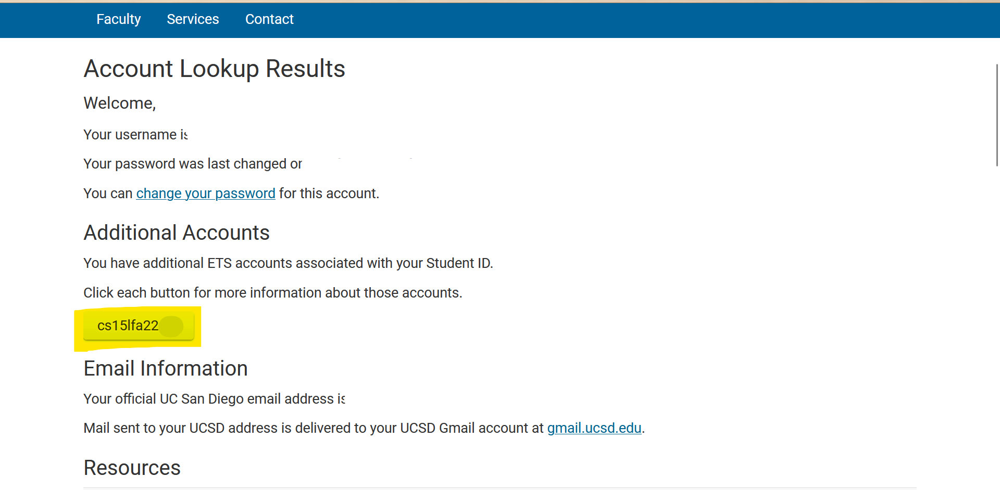

### 2. Install Visual Studio Code
If you haven't already, download VS Code from [this website]( https://code.visualstudio.com/) and follow the installation instructions on your laptop. 
- When you open it, something like this will show up:
    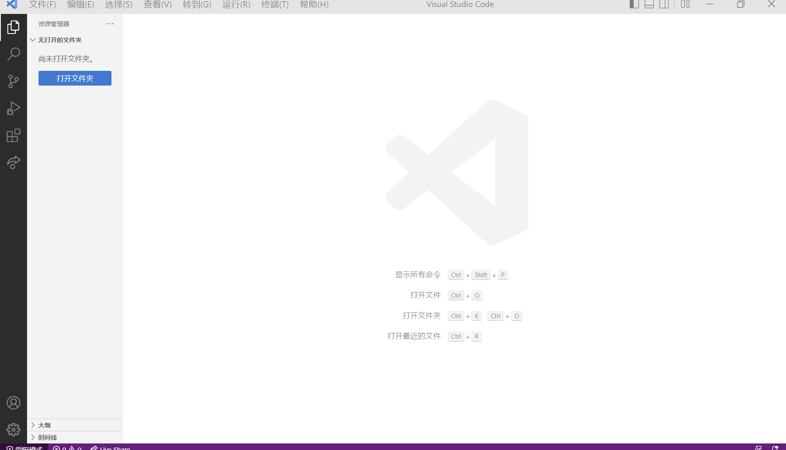

- Open a terminal. You can open a new terminal in VS Code by clicking Ctrl+shift+` or using Terminal -> New terminal in the top menu. You can also use the terminal in your laptop. 

### 3. Establish Remote Access
We will use the command `ssh` (secure shell) for the remote access.
- Open up a terminal, type the following command, with the "x"s being replaced by your account name:
```
$ ssh xxxxxxxxxxx@ieng6.ucsd.edu
```
- Then you will need to type in your password. The password you type will *not* show up on the screen. You can first type it elsewhere and paste it to prevent typos.

- The first time you connect, there may be a message to ask you if you want to continue connecting (I forgot to take a screenshot in lab of that message). Type "yes".

- Then you might see something like:

    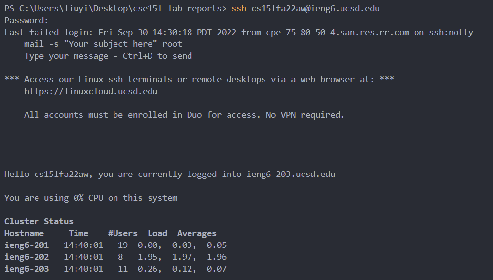
    
_Congratulations! This means you are in._ 

- If you are prompted to type the password multiple times and are still unable to log in, try changing your **course specific (NOT your tritonlink account name)** password [here](https://sdacs.ucsd.edu/~icc/password.php). 

### 4. Running Commands
Try out some basic commands. 
- `cd`: change directory ; `cd ~`: change to home directory ; `ls`: list files ; `cat`: print out content ; `ls-lat`: list files with full information
    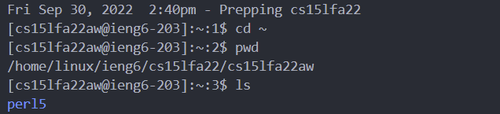
    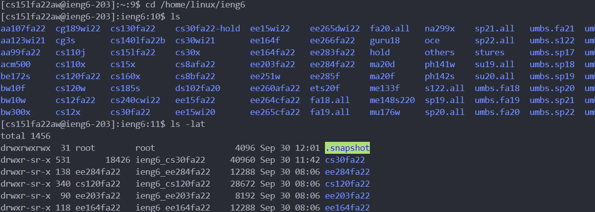

- Try to change directory to another account. You should be able to access the public account, but not the account of another student. 
    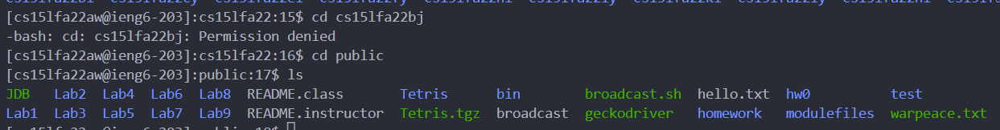

### 5. Create a Secure Copy 
- Log out of ssh using `exit`. 

- Create the a .java file in VS Code and run it on your own laptop. You can use the following code. 
    ```
    class WhereAmI {
        public static void main(String[] args) {
            System.out.println(System.getProperty("os.name"));
            System.out.println(System.getProperty("user.name"));
            System.out.println(System.getProperty("user.home"));
            System.out.println(System.getProperty("user.dir"));
        }
      }
    ```
    This will print out the name of your operating system, your user name, home directory, and working directory. For example: 
    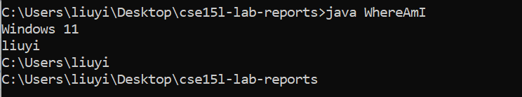
    
    *(This screenshot is from my laptop cmd. You can also run it either through VS code.)*

- Now, move the file from your laptop to the server using the `scp` (secure copy) command. Then, log into your remote access account. 
    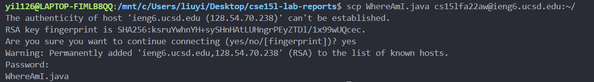

- Run the file again and you will see something like this. Notice that the system, name, and directories change. 
    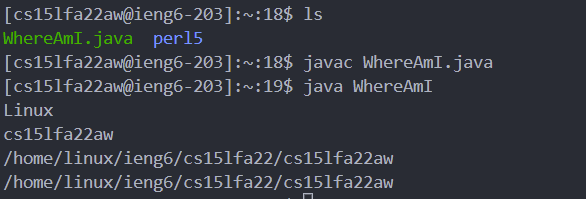

### 6. Set an SSH Key
Switching between accounts can be very repetitive, so we will set an ssh key to solve this problem. The idea is to generate a public-private key pair. Store the public key in the server and the private key in your laptop. The next time you need to switch between server and client, ssh will use the key pair instead of asking for your password. 
- On your laptop, use the `ssh-keygen` command to create keys. Press `Enter` to save the key at the default path. Then enter a passphrase (or press `Enter` for no passphrase). 
    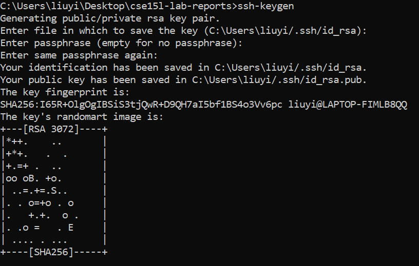

- If you are on windows, your ssh-agent(which saves the key) is disabled by default. Follow the steps from [this link](https://learn.microsoft.com/en-us/windows-server/administration/openssh/openssh_keymanagement#user-key-generation) or [this link](https://stackoverflow.com/questions/52113738/starting-ssh-agent-on-windows-10-fails-unable-to-start-ssh-agent-service-erro) to enable your ssh-agent.

- Next, add your key using the `ssh-add` command. 
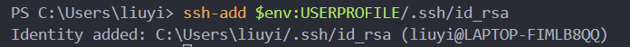

- Create a directory in the server called ".ssh". You can do so by `mkdir`(make directory) in the server. Type this: 
    ```
    mkdir .ssh
    ```
- Then, go back to your local, and copy the public key to your server using `scp`

    ***I was switching between the powershell and wsl linux shell here because I kept getting the `not a directory` error. If you see this too, use `rm .ssh` to remove the file, then create it again, until you can see it with `ls -a`.***

    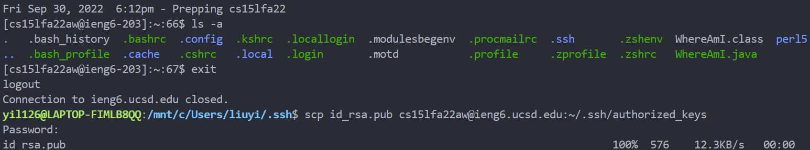

    You should to see the authrorized key in your server if you use `cat`. 

    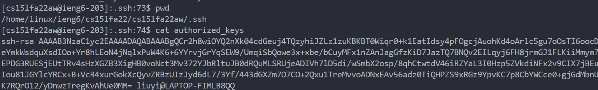

- Now you should be able to `scp` and `ssh` the remote server without typing the password. 
    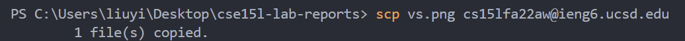

### 7. Make Remote Running More Pleasant
- Make some changes to the local copy of WhereAmI.java.

- Log in to the server, and remove the previous copy of WhereAmI.java & WhereAmI.class we created. Exit.

- In your local machine, `scp` the modified copy to the server.Note that you can avoid typing the username@host again by pressing the **up arrow** on your keyboard. This copies the previous command. 

- If you run the file locally, it will show: 
    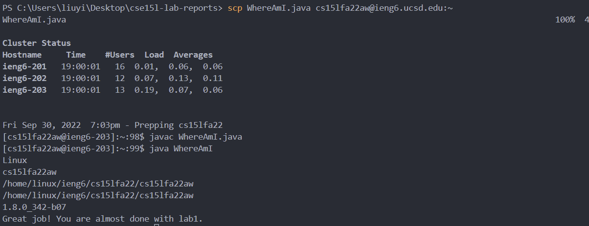

- Use the **up arrow** to log back in to the server and run the file again, it will show: 
    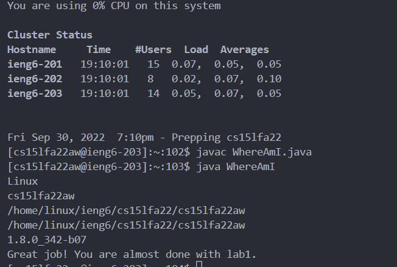
---