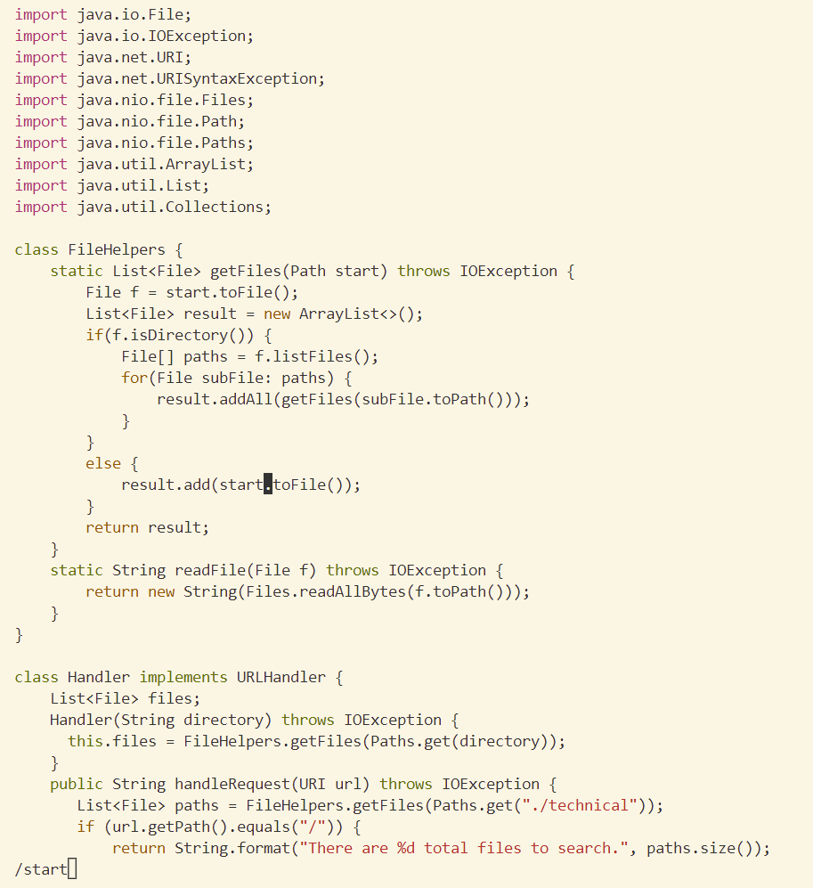
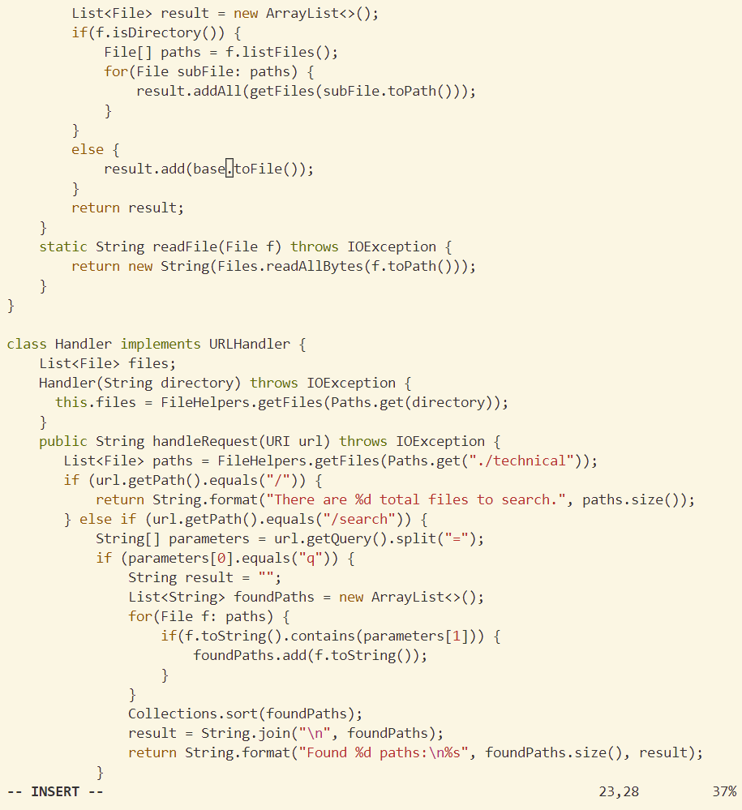
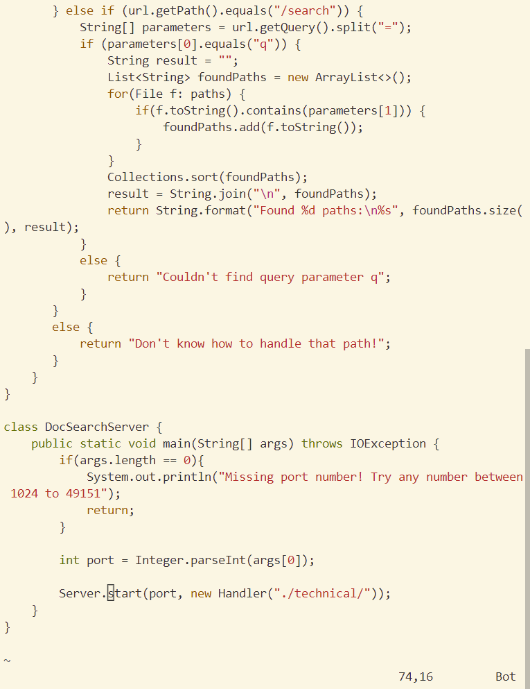
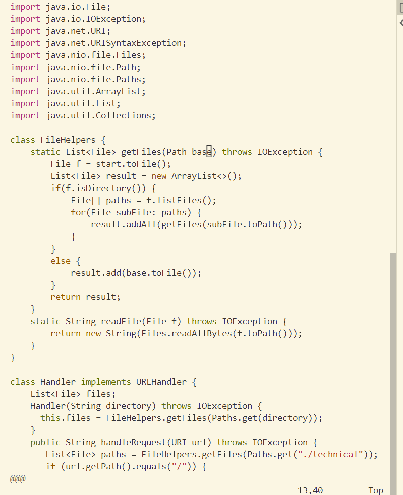
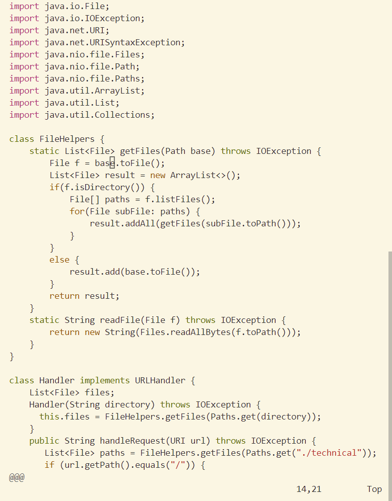
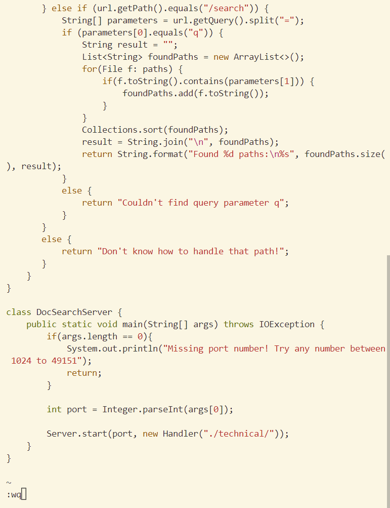

# Lab Report 4: Vim
### Part 1
 **Use Vim to accomplish task from week6 lab session: In DocSearchServer.java, change the name of the start parameter of getFiles, and all of its uses, to instead be called base.**

- open file in vim
    ```
    vim DocSearchServer.java <Enter>
    ```
- find "start"
    ```
    /start <Enter>
    ```
    
- change to the end of word, then insert the new name "base"
    ```
    cebase <Esc>
    ```
    

- go to the next occurence of start and repeat the process. Press "n" (next) and "." (repeat). Change 2 of the "start"s. 
    ```
    n n . n . 
    ```
    
    
    

- save and exit.
    ```
    <Esc> :wq <Enter>
    ```
    

---
### Part 2
*Consider performing the edit task you chose and re-running the program when you have to run it remotely. 
Once, start in Visual Studio Code and make the edit there, then scp the file to the remote server and run it there to confirm it works (you can just run bash test.sh on the remote to test it out). Consider having the appropriate scp command in your command history or easily copy-pasteable! Second, start already logged into a ssh session. Then, make the edit for the task you chose in Vim, then exit Vim and run bash test.sh.*

**Making edit on locally**

Starting with the java file ready in VS Code, it took 51 seconds to finish the edit, ssh into remote, and run the test. The scp and ssh commands were typed previously in the terminal, but I still had to cd into the correct folder after ssh log in. 

**Making edit in remote**

Starting from a ssh session, it took 42 seconds to finish the edit and run the test. Every command was smooth and fast thanks to the multiple practices that I had when completing part 1 of the lab report. 

**Which of these two styles would you prefer using if you had to work on a program that you were running remotely, and why?**

If the program isn't complicated or I'm just making a small edit like the task in Part1, I'd prefer using Vim so that I won't have to clone the folder/ scp files back and forth. If the program is long and complicated, I'd prefer doing it locally because it helps when I can see the color-coded variables, warnings, and folder layout in VS Code. 

**What about the project or task might factor into your decision one way or another? (If nothing would affect your decision, say so and why!)**

Aside from the complexity of the edit, I would consider how familiar I am with the task. If I know I'll probably mess up the first time, I'd use a local copy. Also, if I'm going to work on multiple files, I'd do it locally.

---